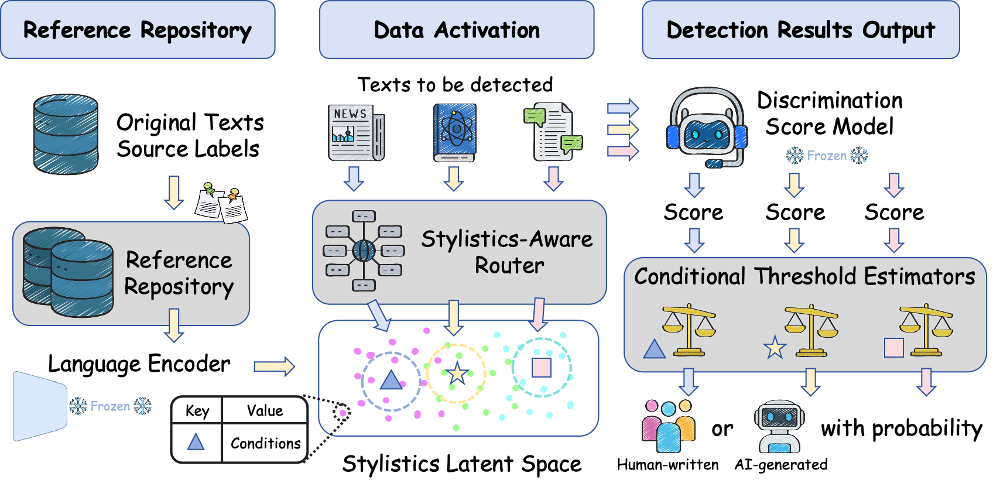

<h1>MoSEs: Uncertainty-Aware AI-Generated Text Detection via Mixture of Stylistics Experts with Conditional Thresholds</h1>


## 🖼️ Framework

The figure below provides an overview of the MoSEs detection framework. First, we build a Stylistics Reference Repository (SRR) annotated with conditional features and semantic embeddings. Then, for a text to be detected, we use a Stylistics-Aware Router (SAR) to activate the most relevant reference samples. Finally, the Conditional Threshold Estimator (CTE) uses these activated samples to dynamically determine a classification threshold and outputs the final prediction with a confidence probability.




---

## 🛠️ Setup

1.  **Clone the repository:**
    ```bash
    git clone https://github.com/creator-xi/MoSEs.git
    cd MoSEs
    ```

2.  **Create a Conda environment and install dependencies:**
    ```bash
    conda create -n moses python=3.10
    conda activate moses
    pip install -r requirements.txt
    ```

---

## 🚀 Quick Start

This section provides a step-by-step guide to reproduce the results presented in our paper.

### Step 1: Prepare Datasets

First, we need to process the raw data. The `split_datasets.py` script reads the source CSV files (e.g., from `data/doc4split/`), calculates semantic embeddings, conditional features (`cond`), and a base discrimination score (`crit`) for each text.

The provided shell scripts in `examples/split_dataset/` automate this process. For example:
```bash
# This script processes the data using the "fast-detect-gpt" method for the 'crit' score.
bash examples/split_dataset/run_split_datasets_fast.sh
```
This will generate a set of JSON files in a new directory (e.g., `data/split_datasets_bge_m3_tiny_encode_crit_cond6_main_1000_fast/`), where each file corresponds to a specific dataset style (e.g., `cmv_dataset.json`, `xsum_dataset.json`).

### Step 2: Create Train/Test Splits

Next, we split the processed JSON files from the previous step into training and testing sets using `process_csv.py`. The training set will serve as the Stylistics Reference Repository (SRR).

The scripts in `examples/process_csv/` automate this split. For example:
```bash
# This script splits the data generated in the previous step into train and test sets.
bash examples/process_csv/run_process_csv_fast.sh
```
This creates two new directories, such as `..._fast_train` and `..._fast_test`, containing the final data splits.

### Step 3: Train the Stylistics-Aware Router (SAR)

The SAR model is trained to identify the style of an input text and retrieve relevant reference samples from the SRR.

To train the SAR model, run the script in `examples/run_sar/`:
```bash
# This command trains the SAR and saves the model weights and class names.
bash examples/run_sar/run_train.sh
```
This will save the trained model (`subcentroids_head_epochxx.pt`) and the style class names (`class_names.json`) into the `weights/` directory. These artifacts are required for the final evaluation step.

### Step 4: Run Evaluation with the Conditional Threshold Estimator (CTE)

Finally, we evaluate the full MoSEs framework. The `CTE.py` script takes a test file, uses the trained SAR to retrieve relevant data from the SRR (the `..._train` folder), and then trains and evaluates the Conditional Threshold Estimator on the fly for each sample in the test set.

The scripts in `examples/run_cte/` run this final evaluation. For example:
```bash
# This script evaluates the MoSEs framework on all test sets.
# Note: Please check and modify the SAR_PATH in the script to point to your trained model, e.g., subcentroids_head_epoch100.pt
bash examples/run_cte/run_cte_fast_detect.sh
```
The script will iterate through the test files, print the evaluation metrics (Accuracy, F1-score, etc.) for each, and save the detailed results to a JSON file in the `logs/` directory.

---

## ✍️ Citation

If you find our work useful for your research, please cite our paper:

```bibtex
@inproceedings{wu2025moses,
  title={MoSEs: Uncertainty-Aware AI-Generated Text Detection via Mixture of Stylistics Experts with Conditional Thresholds},
  author={Wu, Junxi and Wang, Jinpeng and Liu, Zheng and Chen, Bin and Hu, Dongjian and Wu, Hao and Xia, Shu-Tao},
  booktitle={Proceedings of the 2025 Conference on Empirical Methods in Natural Language Processing},
  year={2025},
  publisher={Association for Computational Linguistics}
}
```